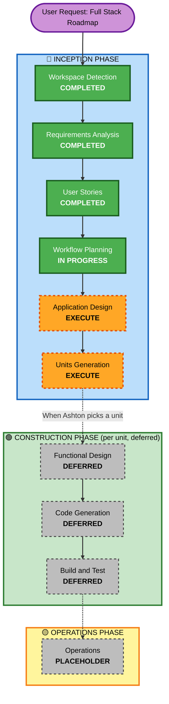

# Execution Plan — Full Stack Roadmap (Phase 0 → 3 → 4 → 5)

## Detailed Analysis Summary

### Transformation Scope (Brownfield)
- **Transformation Type**: Architectural — introduces a backend (Supabase), auth, and multi-user permissions where none existed; also sequences the three remaining un-built feature phases on top of it.
- **Primary Changes**: `storage.js` rewritten to call Supabase instead of localStorage (same function signatures); new auth/login UI; new invite + per-page visibility UI; new revision-history UI; new Character and World features built directly against the new backend.
- **Related Components**: `storage.js`, `app.js`, all page HTML files (need auth-aware nav), `sessions.js`/`sessionPanel.js` (need visibility-toggle UI), new `characters.js`/`world.js` (currently stubs).

### Change Impact Assessment
- **User-facing changes**: Yes — login screen, campaign invite flow, per-page "visible to players" toggle, revision history UI. This is the first time the app has more than one type of user.
- **Structural changes**: Yes — storage layer swaps from localStorage to Supabase; this is exactly the seam CLAUDE.md's `storage.js` abstraction was designed for.
- **Data model changes**: Yes — new `users`/`auth`, `campaign_members` (invite + role), `revisions`, plus per-row `visible_to_players` flag on session/character/world tables; Character and Location models (drafted, unconfirmed in CLAUDE.md) need to be finalized as part of this.
- **API changes**: N/A in the traditional sense (no custom API layer) — Supabase's client SDK + RLS policies function as the API contract.
- **NFR impact**: Yes — security (RLS is the entire enforcement mechanism for the permission model from `stories.md`), and Ashton's "fully fledged app" directive means Security Baseline should be reconsidered (currently "No" in `aidlc-state.md`).

### Component Relationships
- **Primary Component**: `storage.js` (the seam everything else depends on)
- **Dependent Components**: `sessions.js`, `sessionPanel.js`, `app.js`, and the not-yet-built `characters.js`/`world.js` — all call through `storage.js` and don't need to know it talks to Supabase now instead of localStorage
- **New Components**: Supabase project/schema, RLS policies, auth UI, invite UI, visibility-toggle UI, revision-history UI
- **Supporting Components**: One-time localStorage→Supabase migration helper (used once, then retired)

### Risk Assessment
- **Risk Level**: High — real auth, real multi-user permission enforcement (RLS bugs would leak story-critical DM notes, which `stories.md` explicitly calls out as the thing to protect), and a one-time data migration of Ashton's actual existing campaign data.
- **Rollback Complexity**: Moderate — Supabase migration can be done incrementally with the localStorage version left untouched until the new backend is verified working; the risk is the migration helper corrupting or losing existing data, not the backend itself.
- **Testing Complexity**: Complex — RLS policies need explicit testing per persona (DM full access, Player view-only-if-visible, Player denied on hidden pages, revoked Player gets nothing) since a permission bug is invisible in the UI but real at the database level.

## Workflow Visualization

## Phases to Execute

### 🔵 INCEPTION PHASE
- [x] Workspace Detection (COMPLETED)
- [x] Requirements Analysis (COMPLETED)
- [x] User Stories (COMPLETED)
- [x] Workflow Planning (this document)
- [ ] Application Design — **EXECUTE**
  - **Rationale**: New components (Supabase schema, RLS policies, auth) genuinely need identification before any Phase 0 code is written — this isn't a change within existing component boundaries.
- [ ] Units Generation — **EXECUTE**
  - **Rationale**: The roadmap itself is a decomposition into units (Phase 0a-d, Phase 3, Phase 4, Phase 5) — formalizing this as Units Generation output gives each unit clear boundaries and a dependency order.

### 🟢 CONSTRUCTION PHASE (per unit — deferred until a unit is picked up)
- [ ] Functional Design — DEFERRED per-unit
- [ ] Code Generation — DEFERRED per-unit (ALWAYS executes once a unit starts)
- [ ] Build and Test — DEFERRED per-unit (ALWAYS executes once a unit starts)

**Not running Construction now** — this request is "help me plan," not "start building." Construction begins when Ashton says "let's build Phase 0a" (or whichever unit).

### 🟡 OPERATIONS PHASE
- [ ] Operations — PLACEHOLDER (unchanged; GitHub Pages hosting stays manual, Supabase hosting is itself managed/serverless)

## Roadmap: Units and Sequence

| Order | Unit | Depends On | Scope |
|---|---|---|---|
| 1 | **Phase 0a — Supabase Setup & Auth** | none | Create Supabase project; schema for `users`, `campaigns`, `campaign_members` (role: owner/player, status: active/revoked); login/signup UI |
| 2 | **Phase 0b — Storage Layer Migration** | 0a | Rewrite `storage.js` to call Supabase (same function signatures); migrate Session/Campaign tables; RLS: owner full access, member read access gated by `visible_to_players` flag |
| 3 | **Phase 0c — Revision History** | 0b | `revisions` table; view/restore UI (non-destructive restore per Story 10) |
| 4 | **Phase 0d — Player Personal Notes + Visibility Toggle UI** | 0b | Player-owned notes table (isolated RLS); DM-facing per-page "visible to players" toggle UI (Stories 5/6/6b) |
| 5 | **Phase 0e — One-Time Data Migration** | 0b | Helper to move Ashton's existing localStorage campaigns/sessions into Supabase under his account |
| 6 | **Phase 3 — Character Tracker** | 0b, 0d | Confirm Character data model (CLAUDE.md draft); build `characters.js`; apply same visibility/RLS pattern as sessions |
| 7 | **Phase 4 — World-Building** | 0b, 0d | Confirm Location data model; build `world.js`; Leaflet.js maps (a map itself is a natural example of a DM-shared visible page) |
| 8 | **Phase 5 — Polish** | 3, 4 | Markdown editing, tag organization, general polish across all phases |

**Why this order**: 0a→0e must land before Phase 3/4 so Characters and World are built directly against Supabase instead of being built on localStorage and migrated twice. Phase 0d (personal notes + visibility UI) is sequenced before Phase 3/4 because both new phases will need the same visibility-toggle pattern from day one.

## Extension Configuration — Recommendation (not auto-changed)
Given real auth + multi-user data + Ashton's "fully fledged app" directive, recommend re-opting into **Security Baseline** starting at Phase 0a (RLS policies are a security control and should get baseline scrutiny). Resiliency Baseline still reasonably deferred — Supabase is a managed service, so classic resiliency concerns (failover, retries) are mostly its responsibility, not something to build now. This is a recommendation for Ashton to confirm, not applied automatically.

## Estimated Timeline
- **Total Units**: 8 (5 sub-units under Phase 0, plus Phases 3/4/5)
- **Estimated Duration**: Not time-boxed — solo hobby pace, one unit at a time, no forced deadline (per CLAUDE.md's solo-developer pacing note)

## Success Criteria
- **Primary Goal**: A working Supabase-backed multi-user app with DM/player permissions, per-page visibility control, and revision history, with Character Tracker and World-Building built on top of it.
- **Key Deliverables**: Per-unit — a schema, a working feature, and RLS policies tested against every persona/permission case in `stories.md`.
- **Quality Gates**: Each unit's Build and Test stage must explicitly verify permission boundaries (Player cannot read hidden pages or write DM notes; revoked Player gets zero access) since these are security-relevant and invisible in normal UI testing.
