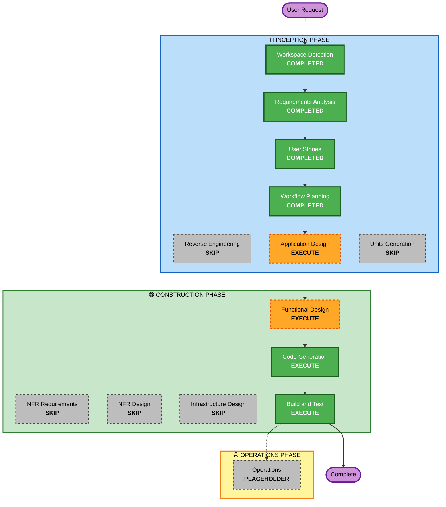

# Execution Plan — Sessions Page: Session Detail Panel

## Detailed Analysis Summary

### Transformation Scope (Brownfield Only)
- **Transformation Type**: Single component change — no architectural transformation. No infrastructure exists to transform (static site + localStorage).
- **Primary Changes**: `sessions.js` gains a new panel/tab/split subsystem; `sessions.html` gains the panel DOM structure; `css/style.css` gains drawer/resize/tab/split-view/confirm-state styling. `storage.js` is used as-is (existing `saveItem`/`loadItem`/`deleteItem`), no changes to its interface.
- **Related Components**: None outside `dnd-notetaker/` — no CDK, no API, no other services.

### Change Impact Assessment
- **User-facing changes**: Yes — replaces the existing "double-click-to-edit inline" interaction entirely with a panel/tab/split system, plus moves delete to hover + inline confirm.
- **Structural changes**: Minor — introduces a new stateful UI subsystem (panel/tab manager) that doesn't fit the current simple render-function style of `sessions.js`; needs its own component boundary (Application Design will define this).
- **Data model changes**: None. All fields used (title, date, inGameDate, summary, tags) already exist in the Session model — no `storage.js` schema changes.
- **API changes**: N/A — no backend/API in this project.
- **NFR impact**: Minor — usability (drag affordances) and data-integrity (flush-on-close for autosave) only, already captured as NFR1–NFR4 in requirements.md. No security/scalability/performance concerns (Security & Resiliency extensions are off for this project).

### Component Relationships (Brownfield Only)
```markdown
## Component Relationships
- **Primary Component**: sessions.js / sessions.html (new panel/tab/split subsystem)
- **Infrastructure Components**: None (static hosting, no cloud infra)
- **Shared Components**: storage.js (used read/write only, no interface changes), css/style.css (extended, not restructured)
- **Dependent Components**: campaigns.html/campaigns.js (unchanged — still links into sessions.html via the existing `?campaign=` URL param)
- **Supporting Components**: None (no monitoring/logging/deployment pipeline for this static app)
```

| Component | Change Type | Change Reason | Priority |
|---|---|---|---|
| sessions.js | Major | New panel/tab/split state management + rendering | Critical |
| sessions.html | Minor | New panel DOM structure/containers | Critical |
| css/style.css | Minor | New styles for drawer, resize handle, tabs, split view, inline confirm state | Critical |
| storage.js | None | Used as-is, no interface changes | N/A |

### Risk Assessment
- **Risk Level**: Medium — isolated to one page/component (easy to reason about, easy rollback via git), but the drag-to-split interaction is a genuinely new, non-trivial UI pattern with real unknowns (already flagged in requirements.md as the piece most likely to need re-scoping).
- **Rollback Complexity**: Easy (single-page static app, git-based rollback, no data migration involved)
- **Testing Complexity**: Moderate (manual browser testing across several interaction states: open/edit/autosave, tab open/switch, drag-to-split, delete confirm/cancel)

## Workflow Visualization



## Phases to Execute

### 🔵 INCEPTION PHASE
- [x] Workspace Detection (COMPLETED)
- [x] Reverse Engineering (SKIPPED — existing CLAUDE.md documentation of this component is current)
- [x] Requirements Analysis (COMPLETED)
- [x] User Stories (COMPLETED)
- [x] Execution Plan (this document — IN PROGRESS)
- [x] Application Design — **EXECUTE**
  - **Rationale**: The panel/tab/split system is a new stateful UI component that doesn't fit inside the current simple render-function style of `sessions.js`. Needs defined component boundaries, methods (open, closeTab, switchTab, detachToSplit, resize, autosave, requestDelete/confirmDelete/cancelDelete), and business rules (debounce timing, tab uniqueness, split constraints) before coding starts.
- [ ] Units Generation — **SKIP**
  - **Rationale**: Single small static app, one developer, no parallel workstreams or independently deployable services. Units Generation's purpose (decomposing a system for parallel/multi-package development) doesn't apply here — Application Design already covers the necessary component definition at this project's scale.

### 🟢 CONSTRUCTION PHASE
- [ ] Functional Design — **EXECUTE**
  - **Rationale**: The panel's state machine (open/closed, active tab, split panes, pending-delete confirmation) is genuinely new business logic worth designing explicitly before implementation, independent of the vanilla-JS tech choice.
- [ ] NFR Requirements — **SKIP**
  - **Rationale**: All applicable NFRs (usability, data integrity) are already fully captured in requirements.md. No new performance/security/scalability requirements, and Security/Resiliency extensions are off for this project. No tech stack decision needed — stays vanilla JS/localStorage.
- [ ] NFR Design — **SKIP**
  - **Rationale**: NFR Requirements is skipped; nothing to design against.
- [ ] Infrastructure Design — **SKIP**
  - **Rationale**: No cloud infrastructure exists or is being introduced (GitHub Pages static hosting + localStorage only).
- [ ] Code Generation — EXECUTE (ALWAYS)
  - **Rationale**: Implementation planning and code generation needed.
- [ ] Build and Test — EXECUTE (ALWAYS)
  - **Rationale**: Manual browser verification across all interaction states needed (this project has no automated test runner).

### 🟡 OPERATIONS PHASE
- [ ] Operations — PLACEHOLDER
  - **Rationale**: Future deployment and monitoring workflows (not applicable yet — GitHub Pages hosting is manual/static).

## Package Change Sequence (Brownfield Only)
N/A — single package, no dependency sequencing needed.

## Estimated Timeline
- **Total Stages**: 4 remaining (Application Design → Functional Design → Code Generation → Build and Test)
- **Estimated Duration**: Not tracked in calendar time for this solo project — sequenced by stage completion, not a schedule.

## Success Criteria
- **Primary Goal**: Sessions page supports the OneNote-style panel/tab/split interaction described in requirements.md, replacing the old inline-edit pattern, with working auto-save and inline delete confirmation.
- **Key Deliverables**: Updated `sessions.js`, `sessions.html`, `css/style.css`; updated CLAUDE.md decision log (retiring the superseded inline-edit decision); manual test pass against all Story 1–4 acceptance criteria.
- **Quality Gates**: All acceptance criteria in `stories.md` verified manually in-browser; no regressions to existing session list / campaign-scoping behavior; known-bugs list in CLAUDE.md not reintroduced (app.js scoping, listItems() key/value handling, duplicate const-in-loop).
